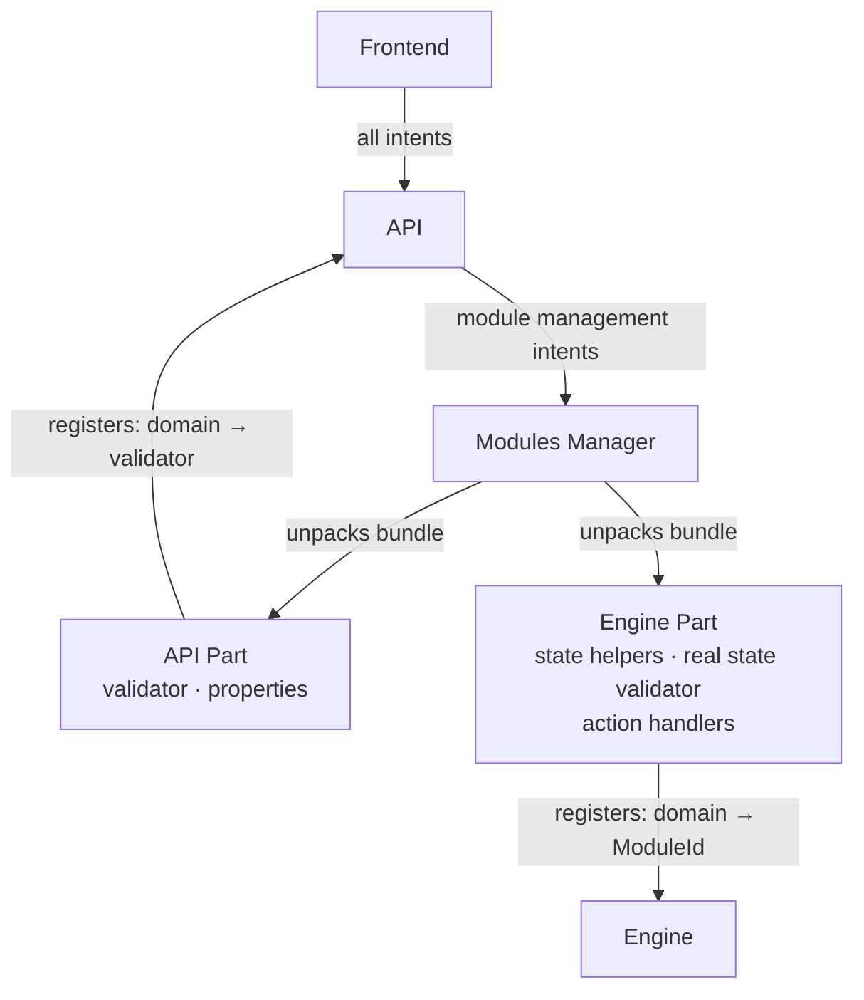

# Modules Manager — Initial Design Notes

This document captures the current thinking on the Modules Manager and Module
Bundle design. It is not a spec — details are still open. It exists so the
idea is not lost between now and implementation.

---

## Modules Manager

Responsible for installing, removing, and managing the presence of modules
across the system. When a module is installed or removed, both the API and
the engine are made aware of the change through the Modules Manager — neither
layer manages this directly.

---

## Module Bundle

A module ships as a bundle with two distinct parts:

**API Part**
- The property definitions specific to this module.
- The properties validator for those properties *(desired-state conflicts only —
  see Validation Model below)*.

**Engine Part**
- State helpers *(read current system state)*.
- Real state validator *(rejects impossible transitions based on current state +
  desired state — see Validation Model below)*.
- Meta action handlers.
- Custom action handlers.
- Config action handlers *(declarative property execution)*.

The bundle is unpacked on install. Each layer receives only what concerns it —
the API never touches execution logic, the engine never touches the validator.

---

## Validation Model

Validation is intentionally split across two layers:

**API validator** — catches logically impossible desired states with no system
knowledge required. Example: `enabled=true` + `masked=true` is impossible
regardless of current state.

**Module real state validator** — catches impossible transitions by comparing
the desired state against the actual current state of the system. Example:
attempting to start a masked service. Only the module can perform this check
because only the module knows how to read current state for its specific init
system.

---

## Relationship
 

The frontend sends module management intents to the API. The API communicates
with the Modules Manager to act on them.

After installation, the API holds a map of domain → validator. The engine
holds a map of domain → ModuleID. Each layer queries its own map independently
— neither reaches into the other's.

---

## Open

- The exact interface the API Part must implement is not yet decided.
- How the Modules Manager persists installed module state is not yet decided.

---

## Future Ideas

**Human-readable error layer** — a layer that knows an error, its cause, and
its solution, expressed in plain language rather than raw system output. The
opposite of logs: aimed at the user and also the technician. At which level this
is achievable and how it fits into the bundle is not yet clear. Not planned for
the near term.

**UI self-description** — right now a module's bundle only tells the engine and API how to do things (state helpers, validators, action handlers). It says nothing about how a frontend should present those things. That's fine for one module and one CLI, but it won't scale: every new module means every frontend (CLI, TUI, future GUI) has to be hand-taught its properties, its actions, what they mean, how to lay them out. That's a per-module, per-frontend cost that multiplies as the module library grows.
The likely direction is that a bundle should carry some description of itself — not a UI, not a layout, just enough plain data (what properties exist, what kind of value each one takes, what the actions are) that any frontend can build its own presentation from it without being told about that module in advance. The frontend still decides what a checkbox looks like; the module just says "this thing is a yes/no."
Not designed. Just flagged so it's not forgotten — it should probably get shaped alongside the API Part of the bundle, since it's the same kind of "module describes itself to the layer above it" idea the validator already uses.
